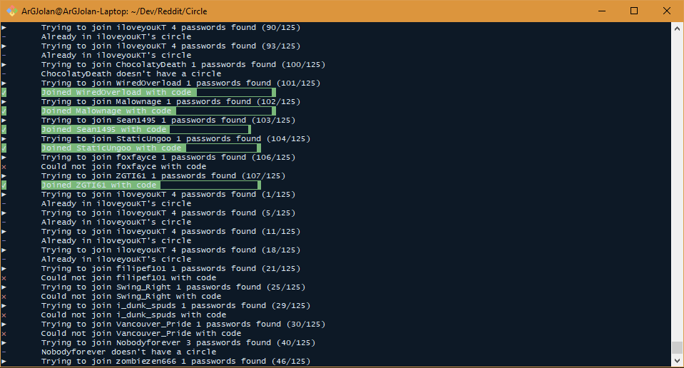

# Circle of trust

## Subreddit

[https://www.reddit.com/r/CircleofTrust/](https://www.reddit.com/r/CircleofTrust/)

## Prerequisites

- Having chrome installed
- npm
- NodeJS
- Mongo server

## Usage

### Setup

`npm install`

### Auth in chromeless

`npm run auth`

### Launch beggar

`npm run beggar`

### Launch message scraper

`npm run scraper`

## Customization

### Custom regex

`scraper/config/config.js` contains two custom regex arrays.

`stringRules` will be used to keep what looks like passwords in entire messages.

`wordRules` will determine if a word alone looks like a password

## In action

